# README

## 流程

用户产生登陆请求，被 controller 利用 servlet 技术捕获，实现 servlet 的类将请求传递给 service 层中的 LoginServiceImpl，service 层再将请求传递给 repository 层中的 ReaderRepositoryImpl 类，ReaderRepositoryImpl 类直接与数据库进行交互。

## 遇到的问题

被 IDEA 给坑了……

在编写 web 项目过程中 src 目录竟然消失了！！但是打开电脑的资源管理器却发现src 文件在哪儿安静的躺着……

在网上找了解决方法后，先删除 .idea 文件（这步之后项目就不是 web 应用了），再重启 IDEA。之后就会生成新的 .idea 文件。会发现 src 文件夹可以显示了。然后就是让项目变成 web 应用。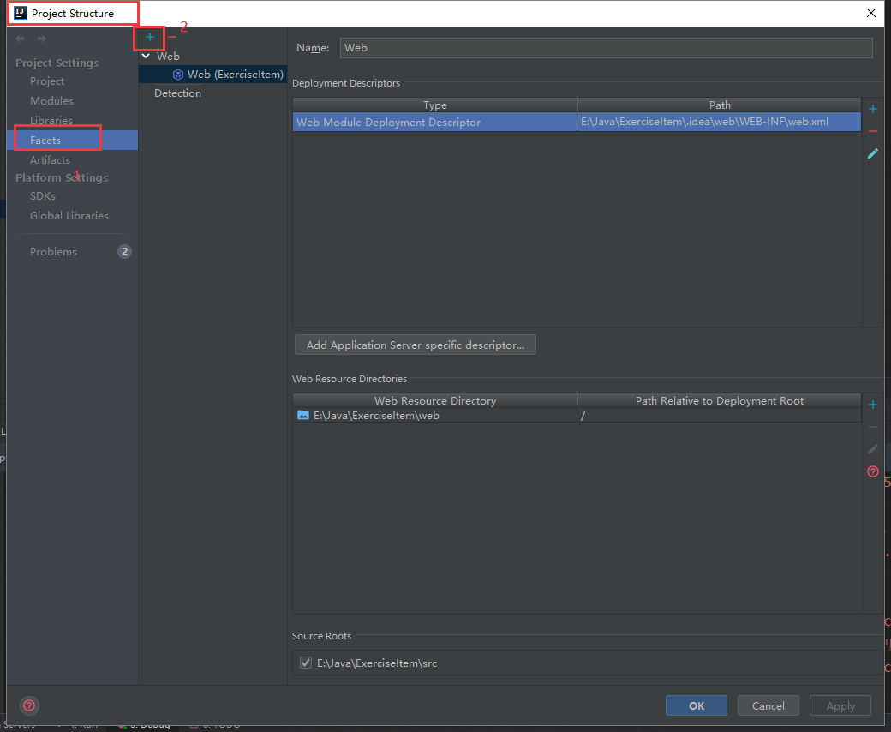

点击 + ，选择 web 应用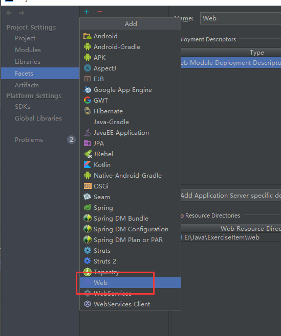

还要将 src 目录变成 Source Folders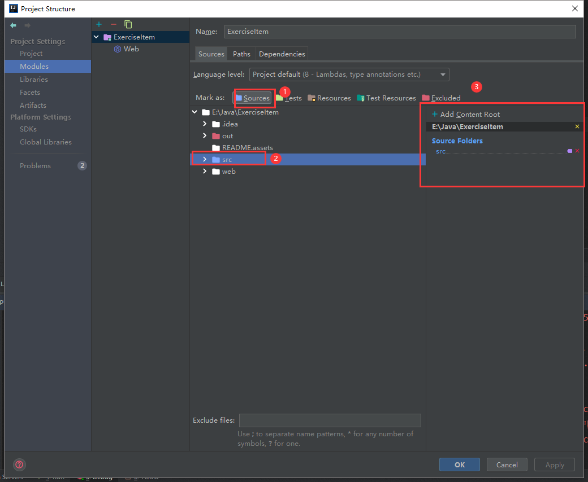

然后，又得重配置 Tomcat，手动将 Tomcat 加到 web 工程中去。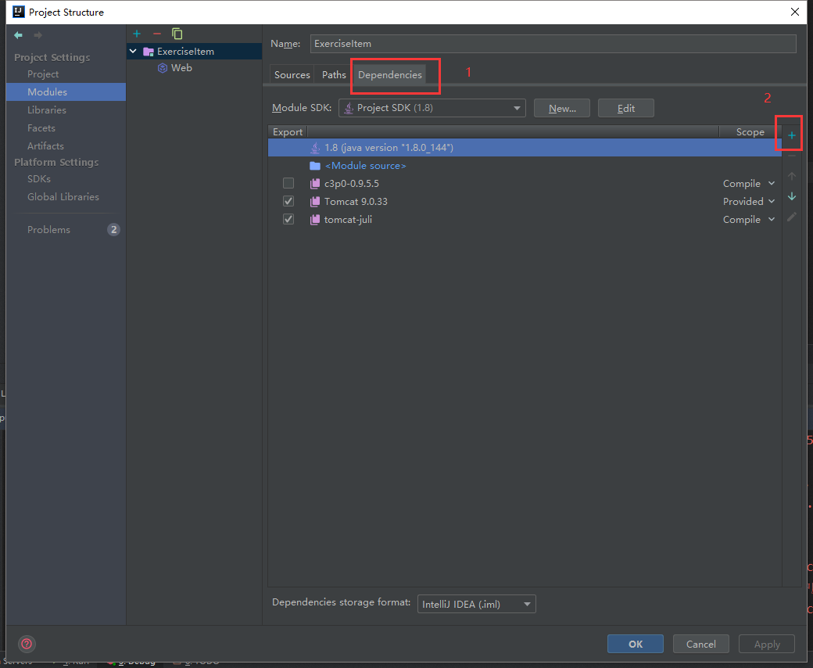

点击 + ，选择 Tomcat，再点击 Library 选项，找到电脑中 tomcat 中 bin 目录下的所有压缩包，全部导入。

要注意工程的压缩包有没有部署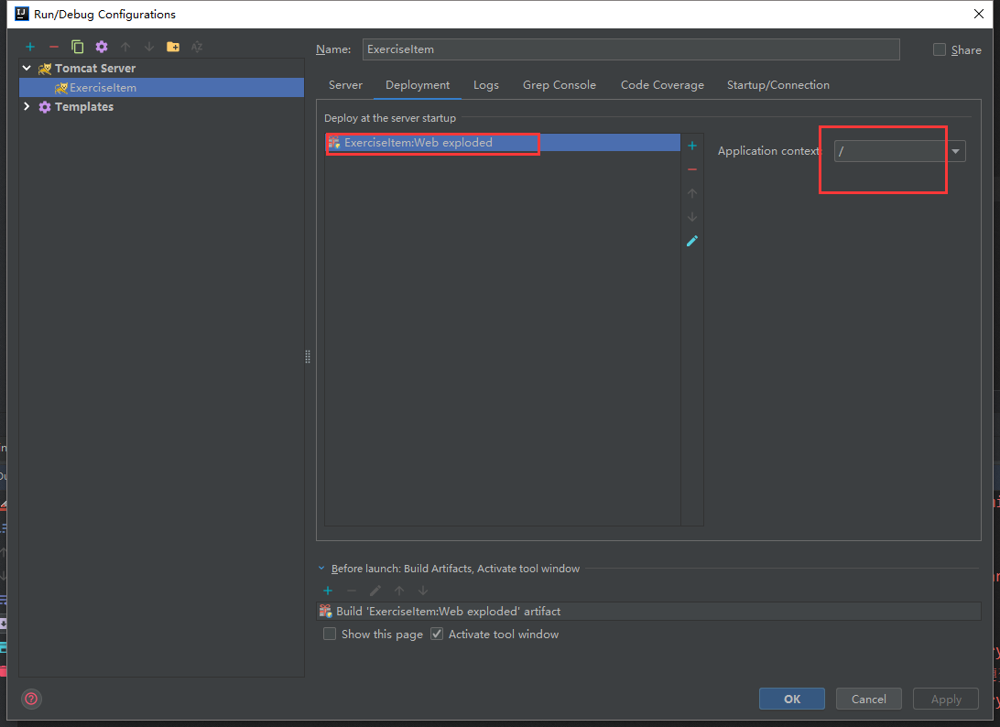

现在就可以运行 Tomcat 了。然后惊奇的发现虽然 Tomcat 可以打开，但是浏览器报404。

原因是资源路径错了，我也不知道为啥会错……

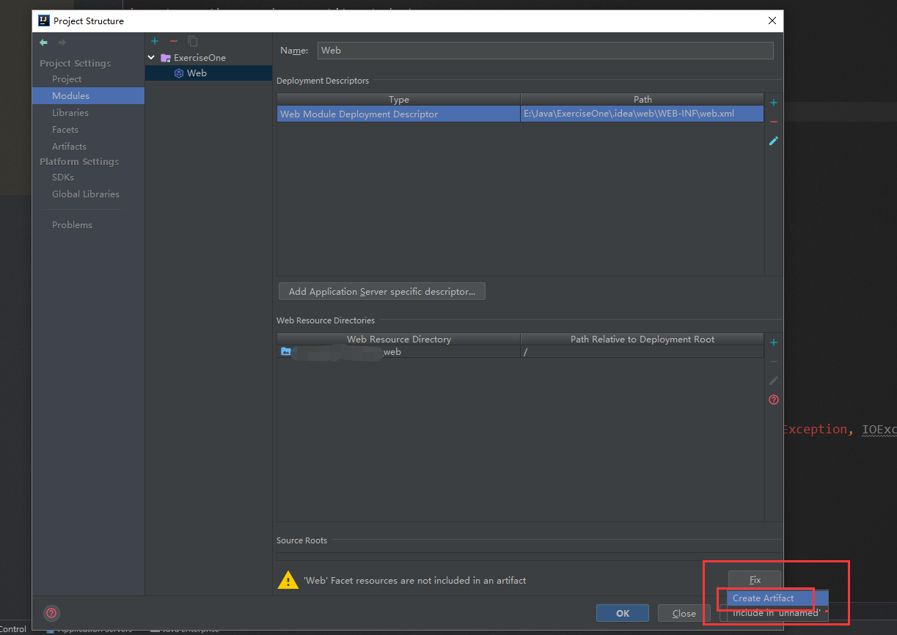

管他三七二十一，先按下 fix 再说……

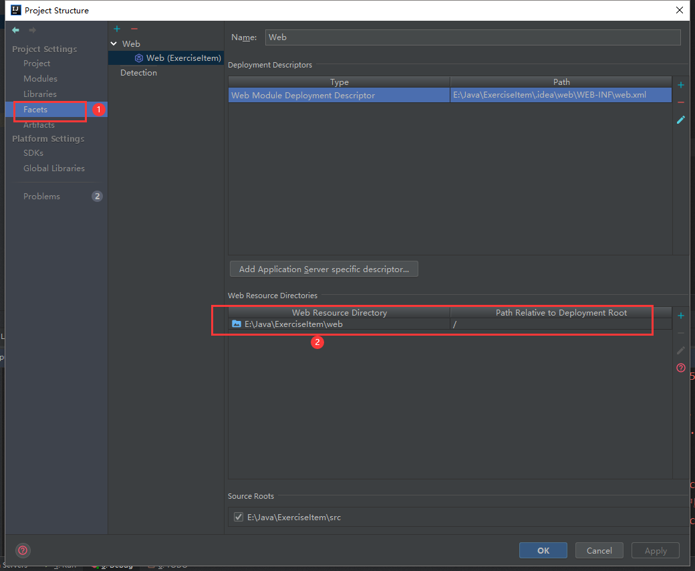

改成工程目录中的 web 路径就可以了。

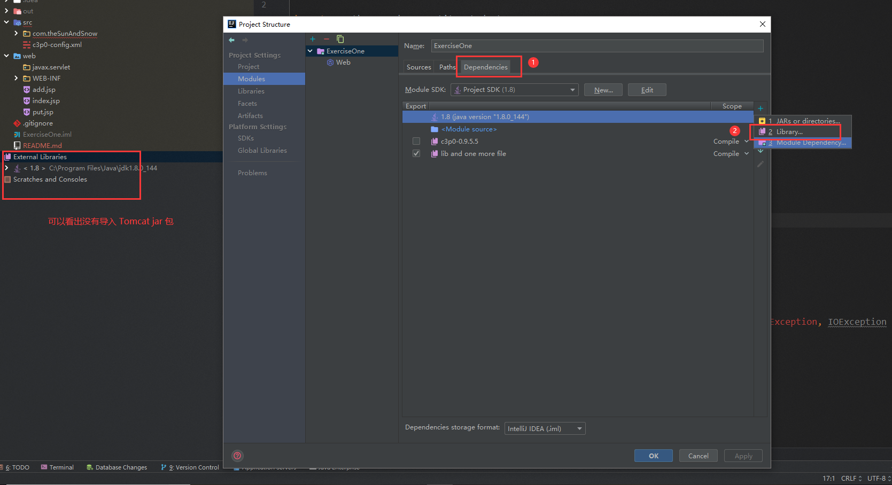

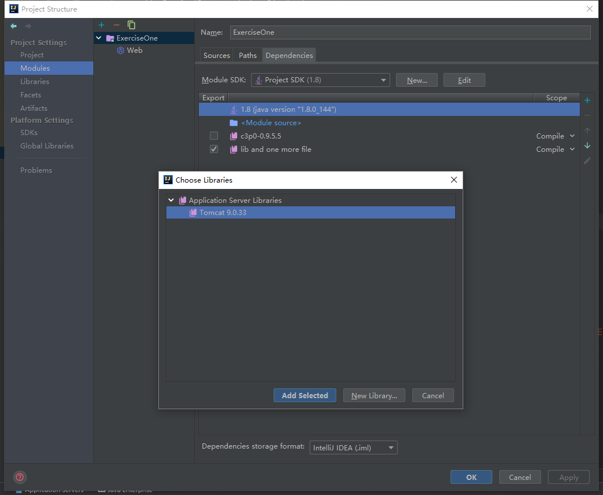

导入后就不会报错了。

在找本地tomcat bin下 的jar 包并导入

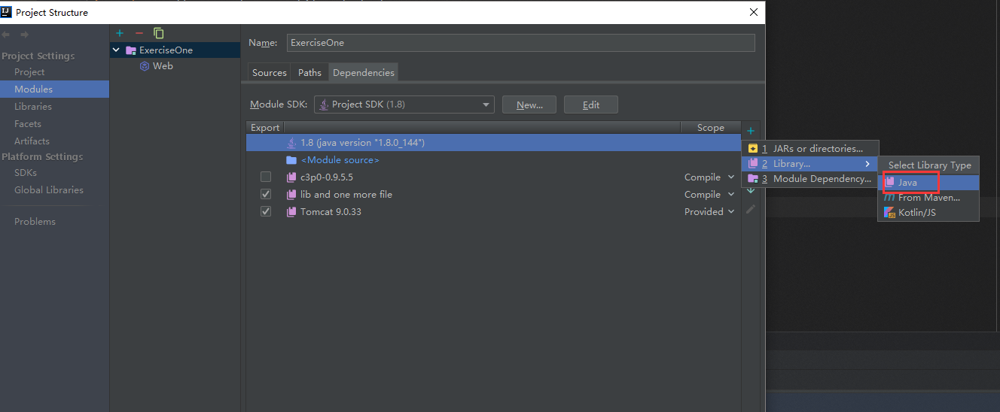

工程不能没有 out 啊

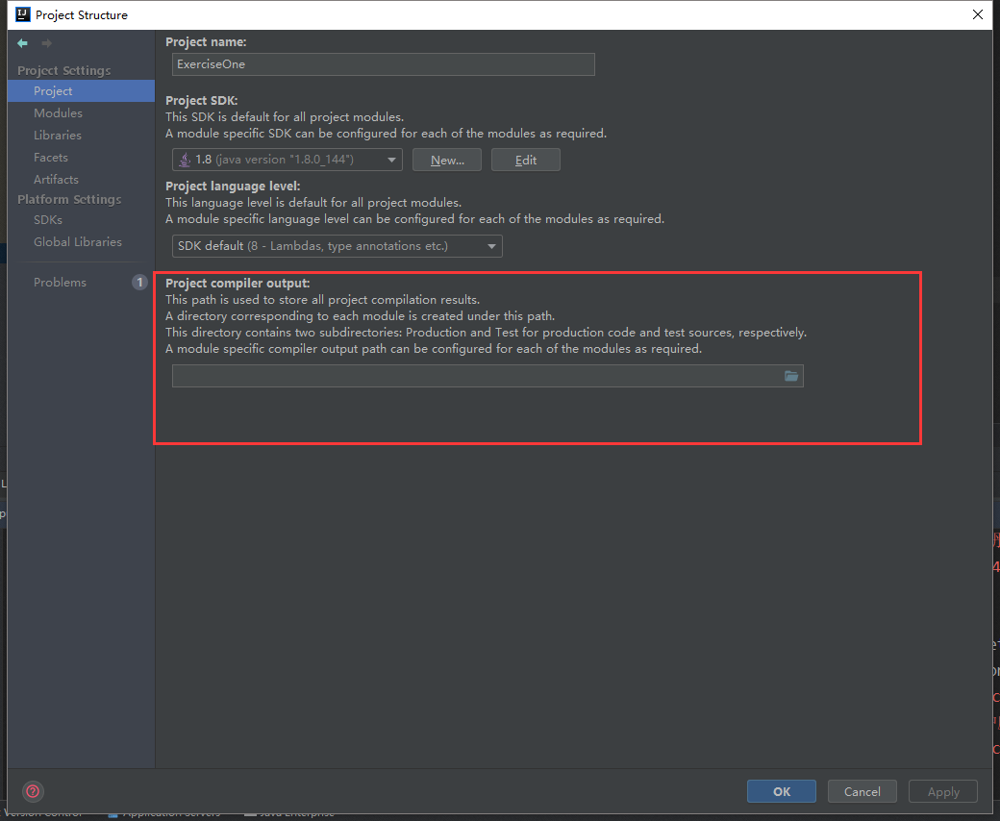

参考：

[如何导入Tomcat jar 包到工程中](https://blog.csdn.net/weixin_44319545/article/details/100544309)

[IDEA 部署Web项目，解决 404 错误](https://blog.csdn.net/eaphyy/article/details/72513914)

